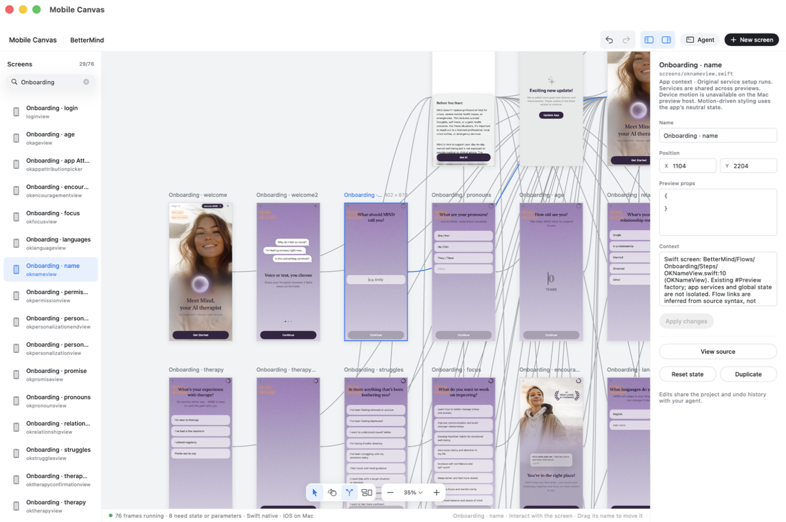

<h1 align="center">Mobile Canvas</h1>
<p align="center"><strong>Your app, on a canvas. Your agent, in the loop.</strong></p>
<p align="center">
  <a href="#get-started">Get started</a> ·
  <a href="#work-with-an-agent">Agent setup</a> ·
  <a href="#prompts-to-try">Try a prompt</a> ·
  <a href="docs/README.md">Docs</a>
</p>

See your app’s screens together, follow their connections, and jump straight to the UI you want to change. Mobile Canvas runs real iOS views on your Mac and gives coding agents the same screen map, source and native screenshots through MCP and CLI.



<p align="center"><sub>BetterMind in the native canvas · Swift previews are experimental</sub></p>

## Get started

**Apple-silicon Mac · arm64 Node 22.14+ · compatible Xcode · development signing**<br>
Expo builds also need CocoaPods. Some apps need Bun. Setup tells you what’s missing.

```sh
npm install -g https://github.com/zvadaadam/mobile-canvas/releases/download/v0.1.0/mobile-canvas-0.1.0.tgz
cd /path/to/your/expo-app
mobile-canvas setup --install
mobile-canvas open
```

The first open builds the native host and can take several minutes. Later opens reuse it. Keep the terminal running. Your app’s source stays in place; experiments are separate until you explicitly apply them.

No service keys? Add `--offline` to both setup and open for supported local previews. Downloads still need internet.

[Full installation guide](docs/distribution.md) · [Try a sample app on another Mac](docs/first-run.md) · [Swift setup](docs/swift-xcode-builds.md)

## Work with an agent

**In the native canvas:** browse screens, follow the flow, compare states and inspect code. The Agent panel supplies MCP configuration for your project.

**In your coding agent:** ask it to map the app, inspect a screen or propose a design change. MCP and CLI share the canvas’s project and undo history.

<details>
<summary><strong>MCP configuration</strong></summary>

Add this to your client’s MCP settings, replacing the app path. Use an absolute executable path if the client cannot find `mobile-canvas`.

```json
{
  "mcpServers": {
    "mobile-canvas": {
      "command": "mobile-canvas",
      "args": ["mcp", "--app", "/absolute/path/to/app"]
    }
  }
}
```

Add `--offline` for supported disconnected previews. For an existing experiment, use `--project /absolute/path/to/experiment` instead of `--app`.

</details>

Start by asking the agent to read `canvas_read_skill`. CLI agents can run:

```sh
mobile-canvas skills get core
```

**Inside an MCP Apps client:** the upcoming embedded review lets you browse the flow and native captures in the conversation with `canvas_view`. Native interaction and animation stay in the Mac window. This feature is currently source-only; the published `0.1.0` includes CLI/MCP tools, but not the embedded review. [MCP Apps setup →](docs/mcp-apps.md)

## Prompts to try

**Explore**

> Use Mobile Canvas to map this app. Inspect three representative screens and explain the main flows. Tell me which previews you couldn’t verify. Don’t change any files.

**Improve**

> Review the onboarding screens in Mobile Canvas. Propose a spacing and typography improvement in a separate experiment, then capture the result. Leave the original app unchanged.

**Diagnose**

> Inspect this empty screen in Mobile Canvas. Check its source, route parameters and preview status. Explain what’s missing before suggesting a fix.

[More prompts, expected results and a first-run checklist →](docs/first-run.md)

## Developer preview

Linked Expo SDK 56/57 are supported; SwiftUI/UIKit support is experimental. Some screens need authentication, real records or device services. A mapped screen is not proof that it rendered correctly. Unavailable states stay in the flow.

Distribution is currently an npm-installable GitHub archive, without a notarized Mac installer or npm-registry release. Another Mac still needs its own Xcode and signing setup. [Known limits and troubleshooting →](docs/agent-workflow.md#interpret-incomplete-previews-honestly)

---

[Documentation](docs/README.md) · [Contributing](CONTRIBUTING.md) · [Report an issue](https://github.com/zvadaadam/mobile-canvas/issues) · [MIT license](LICENSE)

Independent project, not affiliated with Expo. [Third-party notices](THIRD_PARTY_NOTICES.md).
