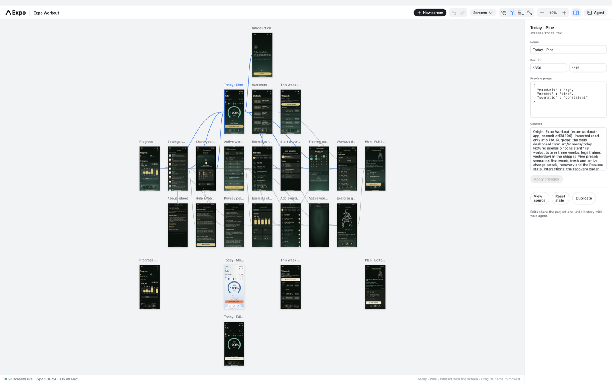

# Mobile Canvas

**See your app's screens together. Give your coding agent the same view.**

Mobile Canvas is a native Mac canvas for exploring and designing real mobile interfaces. It maps an existing app into a flow of screens, runs supported screens as live iOS views, and lets you or an agent jump straight to a design, inspect its source and capture its pixels. You can compare screens and states without repeatedly clicking through a Simulator.

Expo apps are the primary path; SwiftUI/UIKit previews are experimental. This is a **developer preview**, with [known limitations](#what-to-expect).



## Install and open your app

You need an **Apple-silicon Mac**, arm64 **Node 22.14+**, full compatible **Xcode**, and local Apple development signing. Expo native builds also need **CocoaPods**; Bun-based apps need Bun. No global Expo CLI is required. The [installation guide](docs/distribution.md) explains setup, signing and disk usage.

```sh
npm install --global https://github.com/zvadaadam/mobile-canvas/releases/download/v0.1.0/mobile-canvas-0.1.0.tgz
cd /path/to/your/expo-app
mobile-canvas setup --install
mobile-canvas open
```

`setup` checks prerequisites and explains what is missing. `--install` installs the app's dependencies from its supported lockfile. Xcode, your Apple account and signing need to be configured on your Mac. The first `open` builds a native host and can take several minutes; later opens reuse it. Keep that terminal running while using its canvas.

The linked experiment lives separately from your app. Your source stays in place, and experimental overrides, layout and history belong to the Canvas project. Applying an experiment back to the app is a separate, explicit action.

To explore supported local UI without service credentials:

```sh
mobile-canvas setup --install --offline
mobile-canvas open --offline
```

`--offline` disconnects supported service integrations; it does not create missing backend records or remove the need for internet during dependency downloads.

The download above is an npm-installable GitHub release. **The npm registry package and a notarized Mac installer are not published.** You do not need an npm account to install from the release URL. See [updates and removal](docs/distribution.md#install-the-release).

## Use the canvas

- **Find a screen:** select it in the screen list or click its frame to fit the whole screen. Click again to interact with its native controls.
- **Follow the flow:** Flow shows inferred content-navigation links. In linked Expo previews, navigation focuses the destination frame while the original stays on its route. Tab/back chrome is excluded from the connector graph.
- **Compare designs:** edit fixture props in the inspector, duplicate a screen as another state, or ask your agent to make a source change. Notes record purpose and interactions. Undo and Redo share history with agent transactions.
- **Arrange and move:** Arrange lays out the flow. Drag a frame's name to move it; drag the background to pan. Use the canvas zoom controls, trackpad pinch, or `⇧⌘1` to fit all and `⇧⌘2` to fit the selection.
- **Connect an agent:** the Agent panel supplies the exact MCP configuration for the open project. Agent screen inspection visibly focuses the frame and briefly shows a blue ring.

Ordinary Expo source edits refresh through Metro. Swift changes need a native rebuild/relaunch; resolver and native dependency changes also need reopen/rebuild.

For a source-only map that does not execute the app:

```sh
mobile-canvas map --app /path/to/app --project /path/to/separate-experiment
```

Those initial cards describe source discovery. Run `mobile-canvas open --app /path/to/app --project /path/to/separate-experiment` to enable supported native previews. For Swift, pass its directory explicitly with `--app`; read [Swift setup and limits](docs/swift-xcode-builds.md).

## Use it with a coding agent

Both **CLI and MCP** operate the same local runtime, native window and undo history. Mobile Canvas provides the map, source access and native images; your agent supplies the reasoning and code changes. There is no separate chat or hosted agent service.

### Teach the agent the workflow

The installed product serves its own instructions, so guidance matches the version being used:

```sh
mobile-canvas skills list
mobile-canvas skills get core
mobile-canvas skills get core --full   # also load editing and transaction examples
```

These commands work without a project, Xcode or a running canvas. They also support `--json`. A small [discovery skill](skills/mobile-canvas/SKILL.md) directs compatible agents to this bundled guidance. To install it with the Skills CLI:

```sh
npx skills add zvadaadam/mobile-canvas --skill mobile-canvas
```

Or add this instruction to your agent's project guidance: **“For mobile UI work with Mobile Canvas, first run `mobile-canvas skills get core`.”** No skill installer is required for CLI or MCP usage.

### Connect MCP

Add this entry to your agent's MCP configuration, replacing the app path:

```json
{
  "mcpServers": {
    "mobile-canvas": {
      "command": "mobile-canvas",
      "args": ["mcp", "--app", "/absolute/path/to/app"]
    }
  }
}
```

Use an absolute executable path if the agent cannot find your terminal's `mobile-canvas`. Add `--offline` to the arguments for the supported disconnected preview, or use `--project /absolute/path/to/experiment` to connect to an existing experiment. MCP startup maps source; **`canvas_studio_open` is the explicit step that builds and runs the app**.

The agent can call **`canvas_read_skill`** with `{"name":"core"}` to read the same workflow, or `{"name":"core","full":true}` for editing details. Clients supporting MCP resources can read **`mobile-canvas://skills/core`**. Guidance is bundled locally; it is not fetched from a service.

### The agent's working loop

| Step | MCP capability |
| --- | --- |
| Understand the UI | `canvas_read` lists all frames; `canvas_route_map` gives linked screen IDs, source paths, params, notes, flow links and coverage limits. |
| Open a destination | `canvas_environment` checks prerequisites; `canvas_studio_open` opens the native canvas and can focus a screen by ID. |
| See what actually rendered | `canvas_studio_state` reports readiness/errors; `canvas_inspect_screen` returns a native screen image and metadata. `canvas_studio_capture` captures the visible canvas. |
| Read and change code | `canvas_read_route_source` reads linked app source; `canvas_read_source` reads experiment files. `canvas_batch` applies source/fixture changes with conflict checks and undo. |
| Review a design | Reinspect pixels after edits, use `canvas_arrange` to organize flow, and review `canvas_origin_diff`. Apply selected files only when requested. |

For example, ask your agent:

> Use Mobile Canvas to map this app's onboarding. Inspect each available step, identify inconsistent spacing, and make a separate experiment with a proposed fix. Keep unavailable states visible and tell me what you could not verify.

A CLI agent can use `read`, `studio status`, `studio focus <key>` and `studio capture` with `--project /path/to/experiment`; capture returns a local PNG path. MCP additionally returns per-screen image blocks and a structured sitemap directly. See the [agent workflow](docs/agent-workflow.md) and [editing reference](docs/agents.md).

## What to expect

| Area | Current boundary |
| --- | --- |
| App support | Linked Expo SDK 56/57; authored Expo previews use SDK 54. Swift support is experimental and bounded by supported source/build patterns. |
| Screen coverage | The map infers routes, content links and recognized finite steps. It does not enumerate every runtime redirect, record or local state. A mapped screen is not proof of a working preview. |
| Missing data | Dynamic routes need real parameters; separate frames do not transfer provider/session state. Offline previews cannot supply remote records, purchases or service-owned UI. |
| Native behavior | Camera and other device services can be unavailable. Swift globals/services are not generally isolated, and ordinary Swift navigation is not fully pinned. |
| Reliability | SDK 57 can crash on a full native reload after a component export change. Stop/reopen that project's canvas and check logs if this happens. |
| Scale and fidelity | Up to 32 Expo or 128 Swift frames. Screens use real native controls, but exact iPhone fidelity and arbitrary-app compatibility are not established. |

An unavailable card stays in the flow with its reason. Check the screen's metadata and host errors before interpreting an empty image as an app design bug. Screenshots prove only what was visible; use live interaction to assess gestures and animation.

The release has been tested through isolated npm installation, CLI/MCP calls, public macOS CI, and native Hot Chocolate/Clarity captures on the development Mac. This does **not** establish that another Mac already has working Xcode/signing or that every screen renders. See [compatibility evidence](docs/compatibility.md) and [distribution verification](docs/distribution.md#validate-before-sharing).

## Contribute

Start with [contributor setup and repository structure](CONTRIBUTING.md). The [documentation index](docs/README.md) links architecture, adapter boundaries and regression commands. Public tests use pinned [Hot Chocolate](https://github.com/expo/hot-chocolate) and [Clarity](https://github.com/SchroederNathan/clarity) checkouts; app source and experiments are not bundled in the product.

[MIT licensed](LICENSE). Independent project, not affiliated with Expo. Bundled assets retain their [third-party notices](THIRD_PARTY_NOTICES.md).
